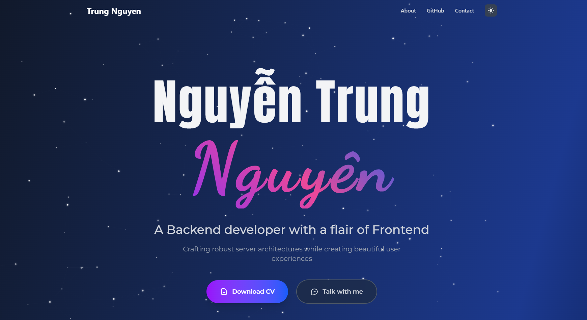

# Trung Nguyen - Portfolio Website



A modern, responsive portfolio website showcasing my work as a Backend developer with a flair of Frontend development. Built with Next.js and featuring a beautiful starry night theme.

## About

This portfolio website presents my professional journey, skills, and projects. It features:

- **Elegant Design**: Dark theme with animated starry background
- **Responsive Layout**: Optimized for all device sizes
- **Modern Stack**: Built with Next.js, TypeScript, and Tailwind CSS
- **Interactive Elements**: Smooth animations and hover effects
- **Professional Presentation**: Clean layout highlighting skills and experience

## Features

- ✨ Animated starry background
- 🎨 Modern gradient text effects
- 📱 Fully responsive design
- ⚡ Fast loading with Next.js optimization
- 🌙 Dark theme interface
- 📄 CV download functionality
- 💬 Contact integration

## Technologies Used

- **Framework**: Next.js 14
- **Language**: TypeScript
- **Styling**: Tailwind CSS
- **Font Optimization**: next/font with Geist
- **Deployment**: Vercel

## Getting Started

First, run the development server:

```bash
npm run dev
# or
yarn dev
# or
pnpm dev
```

Open [http://localhost:3000](http://localhost:3000) with your browser to see the result.

## Deployment

This portfolio is deployed on Vercel. Visit the live site at: [Your Portfolio URL]

The easiest way to deploy your own version is to use the [Vercel Platform](https://vercel.com/new?utm_medium=default-template&filter=next.js&utm_source=create-next-app&utm_campaign=create-next-app-readme).
