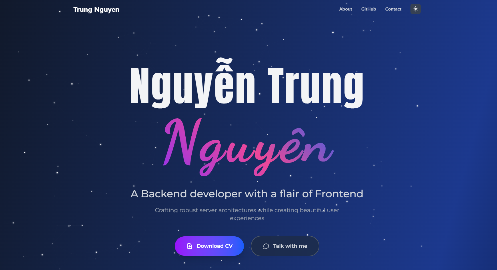

# Nguyễn Trung Nguyên — Portfolio



Single-page portfolio site for a Full-Stack Developer, with an AI chatbot that can drive live UI changes (theme, accent color, hero copy, project highlighting) via tool calling.

## Features

- 🎮 Retro/pixel-art design system (pixel borders, scanlines, dotted dividers) over a starfield/grid background
- 🌗 Dark/light theme via `next-themes`, all colors driven by CSS custom properties
- 🤖 AI chat widget (bottom-right) backed by Groq's `llama-3.3-70b-versatile`, built on Vercel AI SDK v7 — demonstrates AG-UI-style tool calling and context engineering:
  - asks about a project → reads its cached README
  - "đổi màu nền" / "đổi theme" → changes accent color or dark/light mode live
  - "giới thiệu project X" → scrolls to and spotlights a project card
  - surfaces rate-limit / runtime errors to the chat instead of failing silently
- 📬 Contact form sending mail via Gmail (nodemailer)
- 📈 Vercel Speed Insights

## Tech Stack

- **Framework**: Next.js 15 (App Router), React 19, TypeScript
- **Styling**: Tailwind CSS v4
- **Animation**: Framer Motion
- **AI**: Vercel AI SDK v7 + `@ai-sdk/groq`
- **Mail**: Nodemailer (Gmail)
- **Deployment**: Vercel (`output: 'standalone'`)

## Getting Started

```bash
npm install
cp .env.example .env.local   # fill in MAIL_USER, MAIL_PASS, MAIL_RECEIVER, GROQ_API_KEY
npm run dev
```

Open [http://localhost:3000](http://localhost:3000).

See `.env.example` for where each credential comes from (Gmail app password, Groq API key).

## Other commands

```bash
npm run build         # production build — runs ESLint + TypeScript checks
npm run lint           # ESLint
npm run format         # Prettier write
npm run format:check   # Prettier check (CI)
```

There are no automated tests in this project.

## Architecture

See [CLAUDE.md](./CLAUDE.md) for the full breakdown of page structure, data layer, chatbot internals, and theming conventions.

## Deployment

Deployed on [Vercel](https://nguyennguyen0.id.vn).
